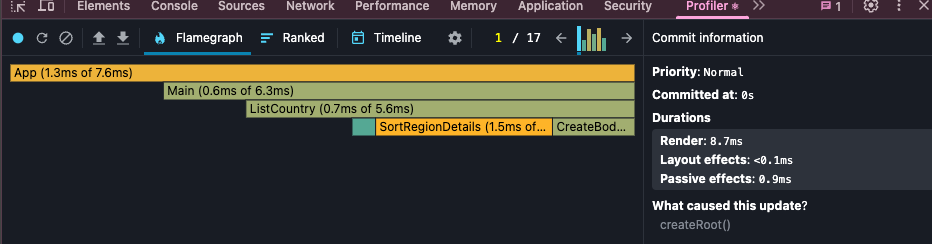
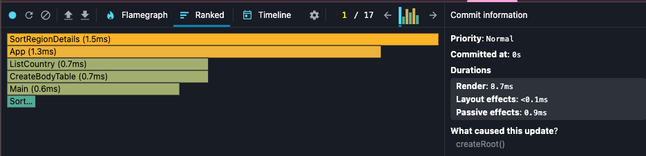
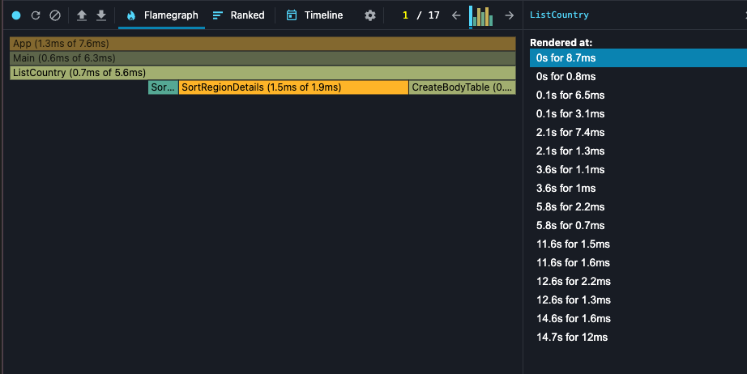

Before Optimization:

Before
Commit Duration: 8.7ms
Render Duration:
App: 1.3ms
Main: 0.6ms
ListCountry: 0.7ms
SortRegionDetails: 1.5ms

After
Commit Duration: 4.7ms (decreased by 4ms)
Render Duration:
App: 0.3ms
Main: 0.2ms
ListCountry: 0.6ms
SortName (Memo): 0.4ms
SortRegionDetails: 0.2ms

Before
Flame Graph: Most of the render time was spent on SortRegionDetails and App.

After
Flame Graph: Render times for components significantly decreased, especially for SortRegionDetails and App.

Before
Ranked Chart:
SortRegionDetails (1.5ms)
App (1.3ms)
ListCountry (0.7ms)
Main (0.6ms)

After
Ranked Chart:
ListCountry (0.6ms)
SortName (Memo) (0.4ms)
App (0.3ms)
Main (0.2ms)
SortRegionDetails (0.2ms)

Conclusions:
Commit Duration decreased by 4ms, indicating an improvement in overall performance.
Render Duration for all components decreased, particularly for SortRegionDetails and App.
The number of interactions triggering renders remained the same, but processing time decreased.
Flame Graph and Ranked Chart show that optimization effectively reduced the render time of key components.
